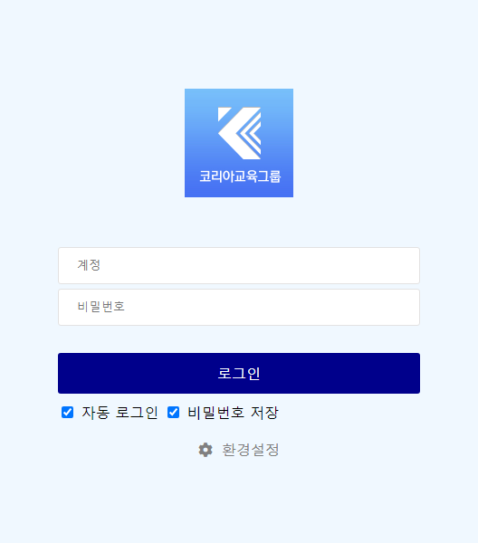
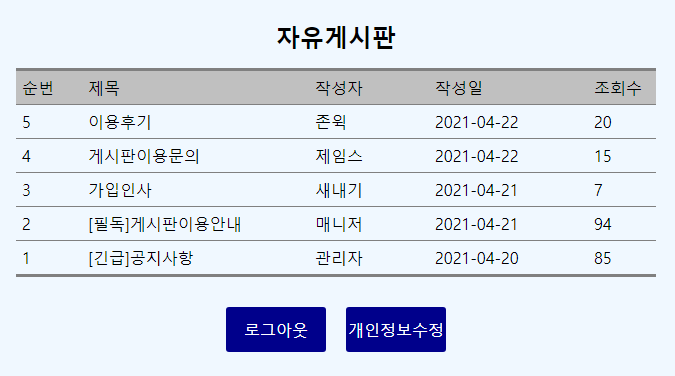
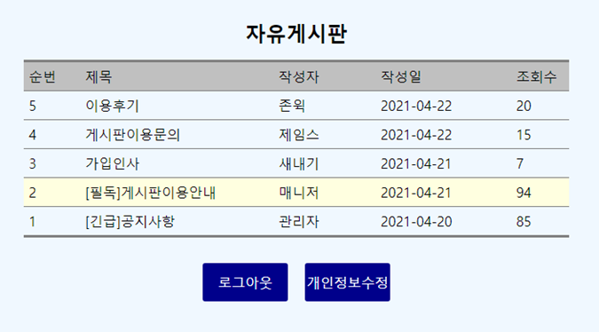
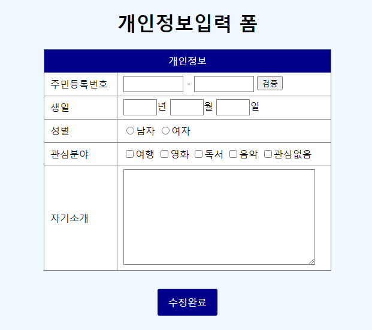

## 1. 아래 문제를 읽고 웹 표준을 준수하는 페이지를 구현하시오. (80점)
1. login.html
   - 화면과 최대한 유사한 형태로 작업하시오.
   - 로고 이미지는 동일하지 않은 임의의 이미지를 사용해도 무방하다.
   - 로그인 버튼을 클릭하면 계정과 비밀번호의 입력 여부와 상관 없이 board.html 페이지로 이동하시오.
     

2. board.html
   - 화면과 최대한 유사한 형태로 작업하시오.
   - 로그아웃 버튼을 클릭하면 login.html 페이지로 이동하시오.
   - 개인정보수정 버튼을 클릭하면 personal_info.html 페이지로 이동하시오.
   - 각 행에 마우스를 가져가면 행 배경색이 변경되도록 작업하시오.
    

    

3. personal_info.html
   - 화면과 최대한 유사한 형태로 작업하시오.
   - 수정완료 버튼을 클릭하면 board.html 페이지로 이동하시오.
    

### 제출방법
- 작성된 파일을 하나로 압축하여 업로드하시오

