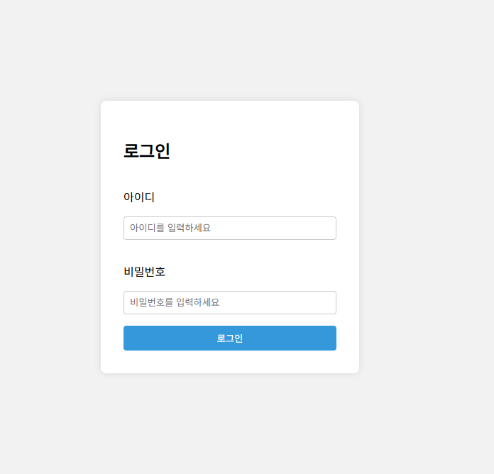
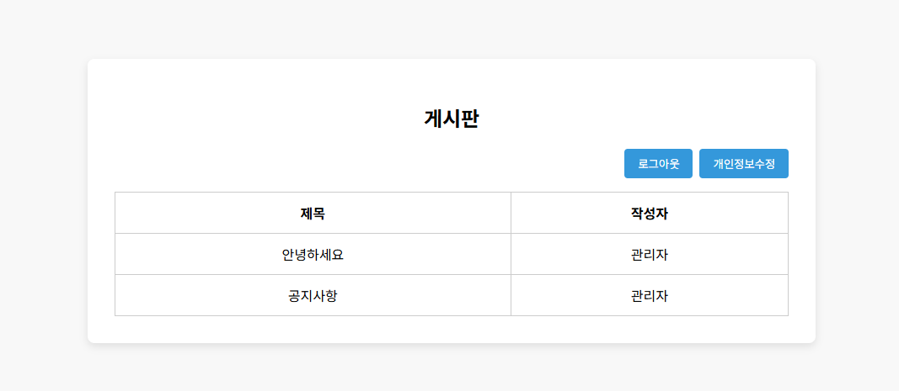

## 반응형 로그인 페이지 UI 디자인 및 구현

## 조건
### login.html
- 외부 CSS 파일로 스타일을 분리하여 구성할 것
- 아이디 입력 시 메시지가 화면에 출력되도록 구현할 것
- JS를 활용해 다음 세 가지를 반드시 구현할 것:
   - submit 시 경고창 출력
   - 자동 커서 이동 또는 포커스 지정
   - 기본 제출 동작 방지
   - 로그인 버튼 클릭 시 board.html로 무조건 이동하도록 설정할 것

### board.html
- 시맨틱하고 적절한 HTML 태그로 게시판 UI를 작성할 것
- CSS로 표 스타일을 구성하며, 각 행에 hover 효과(배경색 변경)를 구현할 것
- 버튼을 클릭하면 각각 login.html, personal_info.html로 이동해야 함

### personal_info.html
- 이름, 이메일 필드를 포함한 개인정보 수정 양식을 구성하고 CSS 디자인 완성도를 높일 것 (제시 레이아웃과 유사하게 90% 이상)

- 수정완료 버튼 클릭 시 board.html로 이동하도록 구현할 것

[img](../img/re_person.png)

## 제출방법
- login.html, login.css, login.js, board.html, personal_info.html, logo.png
- 전부 하나의 압축 파일로 제출