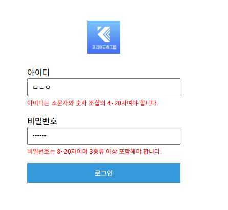

## HTML, CSS, JavaScript로 로그인 화면을 구현하고 유효성 검사 및 동작을 처리하시오.

### 1. 로그인 화면 구성 (HTML)
- 화면 상단 중앙에 logo.png 이미지를 크기 64x64로 배치하고, 클릭하면 http://koreaisacademy.com/으로 이동하도록 구성하시오.
(로고 주소 : http://www.koreastudyroom.com/img/login_logo.jpg)
- 아이디, 비밀번호 입력 필드를 포함한 로그인 폼을 구현하시오.
- 각 입력 필드에 label 태그를 명확히 연결하시오.
- 화면이 로딩되면 아이디 입력란에 자동으로 포커싱 되도록 설정하시오.
- 로그인 버튼은 입력 필드 아래에 위치하도록 구성하시오.

### 2. 화면 스타일 구성 (CSS)
- 로그인 폼 전체를 화면 중앙에 배치하시오.
- 입력창, 버튼, 오류 메시지 등의 기본 스타일을 적용하시오.
- 폼 구성 요소들의 크기와 정렬을 일관성 있게 구성하시오.

### 3. 동작 처리 (JavaScript)
- 아이디 유효성 검사 조건: 소문자 영문과 숫자 조합, 4~20자.
- 비밀번호 유효성 검사 조건: 8~20자, 영문 대소문자, 숫자, 특수문자(!@#$%^&*) 중 최소 3종 이상 포함.
- 각 입력 필드의 blur 이벤트 시 유효성 검사를 수행하고, 유효하지 않을 경우 빨간색 안내 메시지를 입력창 아래에 표시하시오.
- 로그인 버튼 클릭 시 confirm("로그인 하시겠습니까?")을 띄우고, 확인을 누르면 alert("로그인 완료")를 띄우고, 취소를 누르면 아무 동작이 없도록 구현하시오.
- submit 이벤트가 실제 페이지 이동을 일으키지 않도록 처리하시오.

## 제출방법
- login.html,style.css,script.js를 압축하여 제출하기
