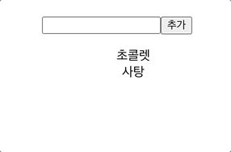
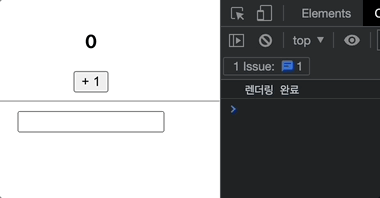
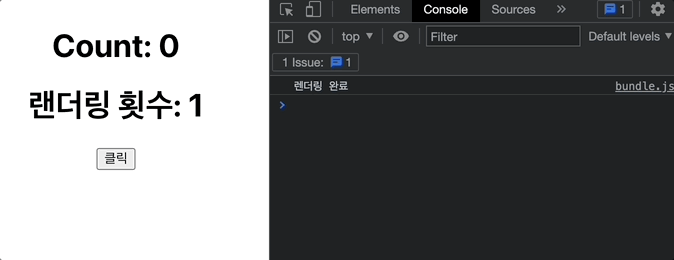
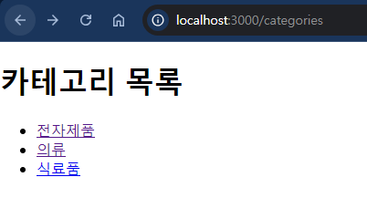
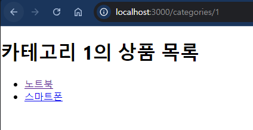
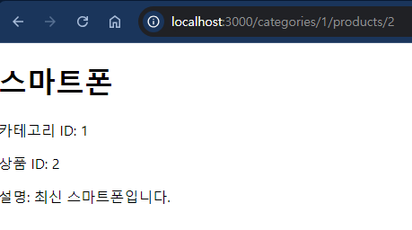
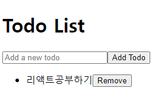
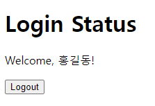
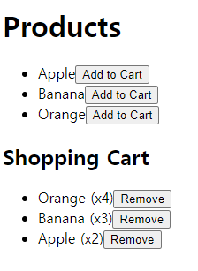

## 1. useState()를 사용하여 다음과 같은 결과가 출력되도록 해보시오.



- src에 Sol1.js 컴포넌트로 만든다.
### 풀이
```js
import React, {useState} from 'react';

function Sol1(){
    const [ eating, SetEating] = useState(['초콜릿','사탕'])
    const[value, SetValue] = useState("");

    const inputHandler = (e) => {
        SetValue(e.target.value)
    }

    const clickHandler = () => {
        SetEating(prev => [value, ...prev])
    }
    return (
        <div>
            <input onChange={inputHandler} type="text"/>
            <buttont onClick={clickHandler}>추가</buttont>
            <ul>
                {eating.map((item,idx) =>(
                    <li key={idx}>{item}</li>
                ))}
            </ul>
        </div>
    )
}

export default Sol1;
```

## 2. useEffect()를 이용하여 다음과 같은 결과를 출력하는 코드를 작성하세요.


```
<<조건>>
- '렌더링 완료' 최초 한번만 출력
- 버튼 클릭 시, 콘솔에 "count 값이 바뀜" 출력
- text 입력 시, 콘솔에 "input 값이 바뀜" 출력
```
- src에 Sol2.js 컴포넌트로 만든다.
### 풀이
```js
import React, {useEffect, useState} from 'react'

function Sol2(){
    const [count, setCount] = useState(0)
    const [text, setText] = useState("");

    const inputHandler = (e) => {
        console.log('input 값이 바뀜')
        setText(e.target.value)
    }

    const countHandler = () => {
        console.log("count값이 바뀜")
        setCount(count + 1)
    }

    useEffect(() => {
        console.log("렌더링 완료")
    },[])

    return(
        <div>
            <h3>{count}<h3>
            <button onClick={countHandler}> + 1 </button>
            <hr/>
            <input onChange={inputHandler} type="text"/>
            <h3>{text}</h3>
        <div>
    );
}

export default Sol2
```

## 3. useEffect()를 사용하여 렌더링 횟수를 출력하는 프로그램을 만들어보세요.



- src에 Sol3.js 컴포넌트로 만든다.
### 풀이
```js
import React, {useEffect, useState} from 'react'

function Sol2(){
    const [count, setCount] = useState(0)
    const [renderCount, setRenderCount] = useState(0);

    const clickHandler = () => {
        setCount(count + 1)
    }

    useEffect(() => {
        setRenderCount(renderCount + 1);
        console.log("렌더링 완료")
    },[count])

    return(
        <div>
            <h1>Count : {count}</h1>
            <h1>렌더링 횟수 : {renderCount}</h1>
            <button onClick={clickhandler}>클릭</button>
        <div>
    );
}

export default Sol3
```

## 상품 카테고리와 상품 상세 페이지를 구현해보자.
- 카테고리별 상품들이 나오게 만들어보세요
```js
<<조건>>
- 카테고리 경로: /categories/:categoryId
- 상품 상세 경로: /categories/:categoryId/products/:productId
- App.js에 컴포넌트 라우트를 설정하세요
- 데이터는 다음을 사용합니다.

- 카테고리
const categories = [
{ id: 1, name: '전자제품' },
{ id: 2, name: '의류' },
{ id: 3, name: '식료품' },
];

- 카테고리별 상품
const products = [
{ id: 1, name: '노트북', categoryId: '1' },
{ id: 2, name: '스마트폰', categoryId: '1' },
{ id: 3, name: '셔츠', categoryId: '2' },
{ id: 4, name: '청바지', categoryId: '2' },
{ id: 5, name: '사과', categoryId: '3' },
{ id: 6, name: '우유', categoryId: '3' },
];

- 상품 상세 정보를 담은 배열
const p_detail = [
{ id: 1, name: '노트북', description: '최신형 노트북입니다.', categoryId: '1' },
{ id: 2, name: '스마트폰', description: '최신 스마트폰입니다.', categoryId: '1' },
{ id: 3, name: '셔츠', description: '멋진 셔츠입니다.', categoryId: '2' },
{ id: 4, name: '청바지', description: '편안한 청바지입니다.', categoryId: '2' },
{ id: 5, name: '사과', description: '신선한 사과입니다.', categoryId: '3' },
{ id: 6, name: '우유', description: '신선한 우유입니다.', categoryId: '3' },
];
```
### 결과 예
- 브라우저에서 /categories로 접속하면 카테고리 목록이 표시된다.


- 카테고리를 클릭하면 해당 카테고리의 상품 목록이 표시된다. 예: /categories/1


- 상품을 클릭하면 해당 상품의 상세 정보가 표시된다. 예: /categories/1/products/2




### 풀이
- App.js
```js
// App.js

import React from 'react';
import { Routes, Route } from 'react-router-dom';
import Categories from './Categories';
import Products from './Products';
import ProductDetail from './ProductDetail';

function App() {
  return (
    <Routes>
      <Route path="/categories" element={<Categories />} />
      <Route path="/categories/:categoryId" element={<Products />} />
      <Route path="/categories/:categoryId/products/:productId" element={<ProductDetail />} />
    </Routes>
  );
}

export default App;
```
- Categories.js
```js
// Categories.js

import React from 'react';
import { Link } from 'react-router-dom';

function Categories() {
  const categories = [
    { id: 1, name: '전자제품' },
    { id: 2, name: '의류' },
    { id: 3, name: '식료품' },
  ];

  return (
    <div>
      <h1>카테고리 목록</h1>
      <ul>
        {categories.map(category => (
          <li key={category.id}>
            <Link to={`/categories/${category.id}`}>{category.name}</Link>
          </li>
        ))}
      </ul>
    </div>
  );
}

export default Categories;
```
- Products.js
```js
// Products.js

import React from 'react';
import { useParams, Link } from 'react-router-dom';

function Products() {
  const { categoryId } = useParams();

  // 실제로는 서버에서 카테고리 ID에 따른 상품 목록을 가져와야 한다.
  // 여기서는 예시를 위해 하드코딩한다.
  const products = [
    { id: 1, name: '노트북', categoryId: '1' },
    { id: 2, name: '스마트폰', categoryId: '1' },
    { id: 3, name: '셔츠', categoryId: '2' },
    { id: 4, name: '청바지', categoryId: '2' },
    { id: 5, name: '사과', categoryId: '3' },
    { id: 6, name: '우유', categoryId: '3' },
  ];

  const filteredProducts = products.filter(product => product.categoryId === categoryId);

  return (
    <div>
      <h1>카테고리 {categoryId}의 상품 목록</h1>
      <ul>
        {filteredProducts.map(product => (
          <li key={product.id}>
            <Link to={`/categories/${categoryId}/products/${product.id}`}>{product.name}</Link>
          </li>
        ))}
      </ul>
    </div>
  );
}

export default Products;
```
- ProductDetail.js
```js
// ProductDetail.js

import React from 'react';
import { useParams } from 'react-router-dom';

function ProductDetail() {
  const { categoryId, productId } = useParams();

  // 상품 상세 정보를 담은 배열
  const p_detail = [
    { id: 1, name: '노트북', description: '최신형 노트북입니다.', categoryId: '1' },
    { id: 2, name: '스마트폰', description: '최신 스마트폰입니다.', categoryId: '1' },
    { id: 3, name: '셔츠', description: '멋진 셔츠입니다.', categoryId: '2' },
    { id: 4, name: '청바지', description: '편안한 청바지입니다.', categoryId: '2' },
    { id: 5, name: '사과', description: '신선한 사과입니다.', categoryId: '3' },
    { id: 6, name: '우유', description: '신선한 우유입니다.', categoryId: '3' },
  ];

  const product = p_detail.find(
    item => item.id === Number(productId) && item.categoryId === categoryId
  );

  if (!product) {
    return <div>상품을 찾을 수 없습니다.</div>;
  }

  return (
    <div>
      <h1>{product.name}</h1>
      <p>카테고리 ID: {categoryId}</p>
      <p>상품 ID: {productId}</p>
      <p>설명: {product.description}</p>
    </div>
  );
}

export default ProductDetail;
```


## URL 파라미터를 사용하여 다국어 지원을 위한 경로를 만들어보자.
- 경로 예시: /:lang/home
lang 파라미터로 언어 코드를 받아서 해당 언어에 맞는 내용을 보여준다.

### 결과 확인
```
- 브라우저에서 /ko/home으로 접속하면 한국어 페이지가 표시된다.
- /en/home으로 접속하면 영어 페이지가 표시된다.
- /jp/home으로 접속하면 일본어 페이지가 표시된다.
- 지원하지 않는 언어 코드로 접속하면 오류 메시지가 표시된다.
```

### 풀이
- index.js
```js
import React from 'react';
import ReactDOM from 'react-dom/client';
import './index.css';
import App from './App';
import reportWebVitals from './reportWebVitals';
import {BrowserRouter} from 'react-router-dom'

const root = ReactDOM.createRoot(document.getElementById('root'));
root.render(
  <BrowserRouter>
    <App />
  </BrowserRouter>
);

// If you want to start measuring performance in your app, pass a function
// to log results (for example: reportWebVitals(console.log))
// or send to an analytics endpoint. Learn more: https://bit.ly/CRA-vitals
reportWebVitals();
```
- App.js
```js

import React from 'react';
import { Routes, Route } from 'react-router-dom';
import Home from './Home';

function App() {
  return (
    <Routes>
      <Route path="/:lang/home" element={<Home />} />
    </Routes>
  );
}

export default App;
```
- Home.js
```js
import React from 'react';
import { useParams } from 'react-router-dom';

function Home() {
  const { lang } = useParams();

  const content = {
    ko: {
      greeting: '안녕하세요!',
      description: '이것은 한국어 페이지입니다.',
    },
    en: {
      greeting: 'Hello!',
      description: 'This is an English page.',
    },
    jp: {
      greeting: 'こんにちは！',
      description: 'これは日本語のページです。',
    },
  };

  const languageContent = content[lang];

  if (!languageContent) {
    return <div>지원하지 않는 언어입니다.</div>;
  }

  return (
    <div>
      <h1>{languageContent.greeting}</h1>
      <p>{languageContent.description}</p>
    </div>
  );
}

export default Home;
```

## 1. Context API로 다크 모드 상태 관리하기
- React의 Context API를 사용하여 **다크 모드(Dark Mode)**를 구현하세요. 
- 사용자는 라이트 모드와 다크 모드를 전환할 수 있어야 하며, 선택된 테마에 따라 화면의 스타일이 변경됩니다.
```js
<<요구 사항>>
1. ThemeContext를 생성하여, 전역적으로 다크 모드 상태를 관리하세요.
2. ThemeProvider 컴포넌트를 만들어, 전역적으로 테마 상태를 관리하고 이를 하위 컴포넌트에 제공하세요.
3. ThemeSwitcher 컴포넌트를 만들어, 사용자가 다크 모드와 라이트 모드를 전환할 수 있게 하세요.
4. App 컴포넌트의 배경색과 텍스트 색상을 다크 모드/라이트 모드에 맞게 변경하세요.
```
### 풀이
####  ThemeContext.js
- 다크 모드 상태를 전역적으로 관리하기 위한 **ThemeContext**와 **ThemeProvider**를 정의한다.
```js
// ThemeContext.js
import React, { createContext, useState } from 'react';

// Context 생성
export const ThemeContext = createContext();

// ThemeProvider 컴포넌트
export const ThemeProvider = ({ children }) => {
  const [isDarkMode, setIsDarkMode] = useState(false); // 기본값은 라이트 모드

  const toggleTheme = () => {
    setIsDarkMode((prevMode) => !prevMode); // 다크 모드와 라이트 모드를 전환
  };

  return (
    <ThemeContext.Provider value={{ isDarkMode, toggleTheme }}>
      {children}
    </ThemeContext.Provider>
  );
};
```

#### App.js
```js
// App.js
import React, { useContext } from 'react';
import { ThemeContext } from './ThemeContext';
import ThemeSwitcher from './ThemeSwitcher';

function App() {
  const { isDarkMode } = useContext(ThemeContext);

  return (
    <div
      style={{
        backgroundColor: isDarkMode ? '#333' : '#fff',
        color: isDarkMode ? '#fff' : '#000',
        height: '100vh',
        display: 'flex',
        justifyContent: 'center',
        alignItems: 'center',
      }}
    >
      <h1>{isDarkMode ? '다크 모드' : '라이트 모드'}</h1>
      <ThemeSwitcher />
    </div>
  );
}

export default App


```

#### ThemeSwitcher.js
```js
// ThemeSwitcher.js
import React, { useContext } from 'react';
import { ThemeContext } from './ThemeProvider';

function ThemeSwitcher() {
  const { isDarkMode, toggleTheme } = useContext(ThemeContext);

  return (
    <button onClick={toggleTheme}>
      {isDarkMode ? '라이트 모드로 전환' : '다크 모드로 전환'}
    </button>
  );
}

export default ThemeSwitcher;
```

#### index.js
```js
import React from 'react';
import ReactDOM from 'react-dom/client';
import './index.css';
import App from './App';
import reportWebVitals from './reportWebVitals';
import { ThemeProvider } from './ThemeContext';

const root = ReactDOM.createRoot(document.getElementById('root'));
root.render(
  <ThemeProvider>
  <App />
  </ThemeProvider>
);

// If you want to start measuring performance in your app, pass a function
// to log results (for example: reportWebVitals(console.log))
// or send to an analytics endpoint. Learn more: https://bit.ly/CRA-vitals
reportWebVitals();
```


## 외부 API로부터 사용자의 이름과 이메일 주소 렌더링하기
- fetch API를 사용하여, 외부 API에서 데이터를 가져와 화면에 렌더링하는 간단한 애플리케이션을 만들어보세요.
```
<<조건>>
외부 API를 호출하여 데이터를 가져옵니다. ([JSONPlaceholder의 사용자 데이터](https://jsonplaceholder.typicode.com/users))
데이터를 가져오는 동안 로딩 상태를 표시해야 합니다.
API 요청 실패 시, 에러 메시지를 표시해야 합니다.
가져온 데이터를 화면에 목록 형태로 출력합니다.
사용자의 이름과 이메일 주소를 표시하세요.
```

### UserList.js
```js
import React, { useState, useEffect } from 'react';

function UserList() {
  const [users, setUsers] = useState([]);        // 사용자 데이터를 저장할 상태
  const [loading, setLoading] = useState(true);  // 로딩 상태 관리
  const [error, setError] = useState(null);      // 에러 상태 관리

  useEffect(() => {
    // 비동기 함수 정의
    const fetchUsers = async () => {
      try {
        const response = await fetch('https://jsonplaceholder.typicode.com/users');
        if (!response.ok) {
          throw new Error('데이터를 불러오는데 실패했습니다.');
        }
        const data = await response.json();
        setUsers(data);  // 데이터를 상태에 저장
      } catch (err) {
        setError(err.message);  // 에러 처리
      } finally {
        setLoading(false);  // 로딩 상태를 완료로 설정
      }
    };


    //useEffect 안에서 fetchUsers()를 호출하는 이유는 useEffect 훅이 비동기 함수를 직접적으로 지원하지 않기 때문이다.
    //
    fetchUsers(); // API 호출
  }, []);

  // 로딩 중일 때 표시할 UI
  if (loading) {
    return <p>로딩 중...</p>;
  }

  // 에러가 발생했을 때 표시할 UI
  if (error) {
    return <p>에러 발생: {error}</p>;
  }

  // 데이터를 성공적으로 불러왔을 때 표시할 UI
  return (
    <div>
      <h1>사용자 목록</h1>
      <ul>
        {users.map((user) => (
          <li key={user.id}>
            {user.name} - {user.email}
          </li>
        ))}
      </ul>
    </div>
  );
}

export default UserList;
````

### 블로그앱 만들기
- 게시물 리스트를 불러오는 컴포넌트
- 게시물 추가 기능
- 게시물 삭제 기능

```js
import React, { useState, useEffect } from 'react';
import axios from 'axios';

function App() {
  const [posts, setPosts] = useState([]);
  const [loading, setLoading] = useState(true);
  const [error, setError] = useState(null);
  const [newPost, setNewPost] = useState({ title: '', body: '' });

  // 게시물 리스트 불러오기
  useEffect(() => {
    const fetchPosts = async () => {
      try {
        const response = await axios.get('https://jsonplaceholder.typicode.com/posts');
        setPosts(response.data);
      } catch (err) {
        setError(err.message);
      } finally {
        setLoading(false);
      }
    };

    fetchPosts();
  }, []);

  // 새 게시물 추가하기
  const addPost = async () => {
    if (!newPost.title || !newPost.body) return alert('모든 필드를 입력해 주세요.');

    try {
      const response = await axios.post('https://jsonplaceholder.typicode.com/posts', newPost);
      setPosts([response.data, ...posts]);
      setNewPost({ title: '', body: '' });
    } catch (err) {
      setError(err.message);
    }
  };

  // 게시물 삭제하기
  const deletePost = async (id) => {
    try {
      await axios.delete(`https://jsonplaceholder.typicode.com/posts/${id}`);
      setPosts(posts.filter(post => post.id !== id));
    } catch (err) {
      setError(err.message);
    }
  };

  if (loading) return <p>Loading posts...</p>;
  if (error) return <p>Error: {error}</p>;

  return (
    <div className="App">
      <h1>블로그 게시물</h1>

      {/* 새 게시물 추가하기 */}
      <div>
        <h2>새 게시물 추가</h2>
        <input
          type="text"
          placeholder="제목"
          value={newPost.title}
          onChange={(e) => setNewPost({ ...newPost, title: e.target.value })}
        />
        <textarea
          placeholder="내용"
          value={newPost.body}
          onChange={(e) => setNewPost({ ...newPost, body: e.target.value })}
        />
        <button onClick={addPost}>게시물 추가</button>
      </div>

      {/* 게시물 리스트 */}
      <div>
        <h2>게시물 리스트</h2>
        {posts.map(post => (
          <div key={post.id} style={{ border: '1px solid black', margin: '10px', padding: '10px' }}>
            <h3>{post.title}</h3>
            <p>{post.body}</p>
            <button onClick={() => deletePost(post.id)}>삭제</button>
          </div>
        ))}
      </div>
    </div>
  );
}

export default App;
```

## 1. Todo 리스트 관리하기
- Redux를 사용하여 Todo 리스트를 관리하는 리듀서를 작성하라.
- 각 Todo 항목은 id와 text 속성을 가진 객체로 구성된다.
- 사용자는 새로운 Todo 항목을 추가할 수 있으며, 특정 Todo 항목을 삭제할 수 있어야 한다.
```
<<조건>>
1. ADD_TODO 액션으로 새로운 Todo 항목을 추가한다.
2. REMOVE_TODO 액션으로 특정 Todo 항목을 삭제한다.
3. 각 Todo 항목은 고유한 id를 가져야 한다.
4. App.js에서 UI를 다음과 같이 구성한다.
```


### actions.js
```jsx
// actions.js
export const addTodo = (id, text) => ({
    type: 'ADD_TODO',
    id,
    text,
  });
  
  export const removeTodo = (id) => ({
    type: 'REMOVE_TODO',
    id,
  });
  ```
  ### reducer.js
  ```jsx
  // reducer.js
const initialState = {
    todos: [],
  };
  
  function todoReducer(state = initialState, action) {
    switch (action.type) {
      case 'ADD_TODO':
        return {
          ...state,
          todos: [...state.todos, { id: action.id, text: action.text }],
        };
      case 'REMOVE_TODO':
        return {
          ...state,
          todos: state.todos.filter(todo => todo.id !== action.id),
        };
      default:
        return state;
    }
  }
  
  export default todoReducer;
  ```

  ### store.js
  ```jsx
  // store.js
import { createStore } from 'redux';
import todoReducer from './reducer';

const store = createStore(todoReducer);

export default store;
```
### App.js
```jsx
// App.js
import React, { useState } from 'react';
import { useDispatch, useSelector } from 'react-redux'; // Redux와 React 연결을 위한 Hook
import { addTodo, removeTodo } from './todo/actions'; // 액션 생성 함수 불러오기

function TodoApp() {
  const [input, setInput] = useState(''); // 입력값을 관리하는 로컬 상태
  const todos = useSelector((state) => state.todos); // Redux에서 todos 상태를 가져옴
  const dispatch = useDispatch(); // 액션을 디스패치하는 함수 가져오기

  const handleAddTodo = () => {
    if (input.trim()) {
      dispatch(addTodo(Date.now(), input)); // 새로운 Todo를 추가 (id는 현재 시간으로 고유값 생성)
      setInput(''); // 입력창 비우기
    }
  };

  const handleRemoveTodo = (id) => {
    dispatch(removeTodo(id)); // Todo를 삭제
  };

  return (
    <div>
      <h1>Todo List</h1>
      <input
        type="text"
        value={input}
        onChange={(e) => setInput(e.target.value)}
        placeholder="Add a new todo"
      />
      <button onClick={handleAddTodo}>Add Todo</button>

      <ul>
        {todos.map((todo) => (
          <li key={todo.id}>
            {todo.text} 
            <button onClick={() => handleRemoveTodo(todo.id)}>Remove</button>
          </li>
        ))}
      </ul>
    </div>
  );
}

export default TodoApp;
```

### index.js
```jsx
// index.js
import React from 'react';
import ReactDOM from 'react-dom';
import { Provider } from 'react-redux'; // Redux 스토어를 React 애플리케이션에 연결하기 위해 사용
import store from './todo/store'; // Redux 스토어 불러오기
import TodoApp from './App'; // TodoApp 컴포넌트 불러오기
import reportWebVitals from './reportWebVitals';

const root = ReactDOM.createRoot(document.getElementById('root'));
root.render(
  <Provider store={store}> 
    <TodoApp />
  </Provider>
);

// If you want to start measuring performance in your app, pass a function
// to log results (for example: reportWebVitals(console.log))
// or send to an analytics endpoint. Learn more: https://bit.ly/CRA-vitals
reportWebVitals();
```

## 2. 로그인 상태 관리하기
- Redux를 사용하여 로그인 상태를 관리하라.
- 사용자가 로그인하면 isLoggedIn 값을 true로 설정하고, 로그아웃하면 이를 false로 설정해야 한다. 
- 사용자의 이름은 useState에 저장하고, 로그아웃 시 이름을 빈 문자열로 초기화해야 한다.

```
<<조건>>
1. LOGIN 액션을 통해 사용자의 로그인 상태를 true로 설정하고, 사용자 이름을 저장한다.
2. LOGOUT 액션을 통해 로그아웃 상태를 false로 설정하고, 사용자 이름을 빈 문자열로 초기화한다.
```


### 로그인 전
- 사용자는 input 필드에 사용자명을 입력하고, Login 버튼을 눌러 로그인할 수 있다.
- 사용자명이 입력되고 로그인 버튼을 누르면 Redux 스토어에 로그인 상태가 저장되고, isLoggedIn: true로 설정된다.



### 로그인 후
- 사용자가 Logout 버튼을 누르면, isLoggedIn 상태가 false로 바뀌며 다시 로그인 화면이 나타난다.
### actions.js
```jsx
// actions.js
export const login = (username) => ({
  type: 'LOGIN',
  username,
});

export const logout = () => ({
  type: 'LOGOUT',
});
```

### reducer.js
```jsx
// reducer.js
const initialState = {
  isLoggedIn: false,
  username: '',
};

function authReducer(state = initialState, action) {
  switch (action.type) {
    case 'LOGIN':
      return {
        ...state,
        isLoggedIn: true,
        username: action.username,
      };
    case 'LOGOUT':
      return {
        ...state,
        isLoggedIn: false,
        username: '',
      };
    default:
      return state;
  }
}

export default authReducer;
```
### store.js
```jsx
// store.js
import { createStore } from 'redux';
import authReducer from './reducer';

const store = createStore(authReducer);

export default store;
```

### App.js
```jsx
// App.js
import React, { useState } from 'react';
import { useDispatch, useSelector } from 'react-redux'; // Redux 관련 훅을 불러옴
import { login, logout } from './actions'; // 액션 생성 함수 불러오기

function AuthApp() {
  const [usernameInput, setUsernameInput] = useState(''); // 입력 필드 상태
  const { isLoggedIn, username } = useSelector((state) => state); // Redux 상태에서 로그인 정보 가져오기
  const dispatch = useDispatch(); // 액션을 디스패치하기 위한 훅

  const handleLogin = () => {
    if (usernameInput.trim()) {
      dispatch(login(usernameInput)); // 로그인 액션 디스패치
      setUsernameInput(''); // 입력 필드 초기화
    }
  };

  const handleLogout = () => {
    dispatch(logout()); // 로그아웃 액션 디스패치
  };

  return (
    <div>
      <h1>Login Status</h1>
      {isLoggedIn ? (
        <div>
          <p>Welcome, {username}!</p>
          <button onClick={handleLogout}>Logout</button>
        </div>
      ) : (
        <div>
          <input
            type="text"
            value={usernameInput}
            onChange={(e) => setUsernameInput(e.target.value)}
            placeholder="Enter your username"
          />
          <button onClick={handleLogin}>Login</button>
        </div>
      )}
    </div>
  );
}

export default AuthApp;
```

### index.js
```jsx
// index.js
import React from 'react';
import ReactDOM from 'react-dom';
import { Provider } from 'react-redux'; // Redux 스토어를 React 앱에 연결하기 위해 사용
import store from './store'; // Redux 스토어 불러오기
import AuthApp from './App'; // AuthApp 컴포넌트 불러오기

ReactDOM.render(
  <Provider store={store}> 
    <AuthApp />
  </Provider>,
  document.getElementById('root')
);
```

## 3. 쇼핑카트 관리하기
- Redux를 사용하여 쇼핑카트를 관리하라.
- 사용자는 제품을 쇼핑카트에 추가하거나, 쇼핑카트에서 제거할 수 있다.
- 각 제품은 id, name, quantity 속성을 가지며, 제품이 추가될 때마다 수량(quantity)이 증가해야 한다.
```js
<<조건>>
1. ADD_TO_CART 액션으로 제품을 쇼핑카트에 추가한다. 이미 카트에 있는 제품일 경우 수량을 증가시킨다.
2. REMOVE_FROM_CART 액션으로 특정 제품을 카트에서 제거한다.

//제품 데이터
const products = [
    { id: 1, name: 'Apple' },
    { id: 2, name: 'Banana' },
    { id: 3, name: 'Orange' },
];
```


### 상품 목록
- 사용자는 애플, 바나나, 오렌지와 같은 상품을 화면에서 볼 수 있다. 
- 각 상품 옆에는 "Add to Cart" 버튼이 있으며, 버튼을 클릭하면 해당 상품이 쇼핑카트에 추가된다.
### 쇼핑카트
- 쇼핑카트에는 추가된 상품과 해당 상품의 수량이 표시된다. 
- 같은 상품을 여러 번 추가하면 수량이 증가하며, 각 상품 옆에는 "Remove" 버튼이 있어 이를 클릭하면 해당 상품이 카트에서 제거된다.

### 빈 카트
- 카트가 비어 있을 경우 Your cart is empty라는 메시지가 표시된다.

### actions.js
```jsx
// actions.js
export const addToCart = (id, name) => ({
  type: 'ADD_TO_CART',
  id,
  name,
});

export const removeFromCart = (id) => ({
  type: 'REMOVE_FROM_CART',
  id,
});
```

### reducer.js
```jsx
// reducer.js
const initialState = {
  cart: [],
};

function cartReducer(state = initialState, action) {
  switch (action.type) {
    case 'ADD_TO_CART':
      const existingProduct = state.cart.find(item => item.id === action.id);
      if (existingProduct) {
        // 제품이 이미 카트에 있으면 수량 증가
        return {
          ...state,
          cart: state.cart.map(item =>
            item.id === action.id
              ? { ...item, quantity: item.quantity + 1 }
              : item
          ),
        };
      } else {
        // 제품이 없으면 새로 추가
        return {
          ...state,
          cart: [...state.cart, { id: action.id, name: action.name, quantity: 1 }],
        };
      }
    case 'REMOVE_FROM_CART':
      return {
        ...state,
        cart: state.cart.filter(item => item.id !== action.id),
      };
    default:
      return state;
  }
}

export default cartReducer;
```

### store.js
```jsx
// store.js
import { createStore } from 'redux';
import cartReducer from './reducer';

const store = createStore(cartReducer);

export default store;
```

### App.js
```jsx
// App.js
import React from 'react';
import { useDispatch, useSelector } from 'react-redux'; // Redux 관련 훅을 불러옴
import { addToCart, removeFromCart } from './actions'; // 액션 생성 함수 불러오기

function ShopApp() {
  const products = [
    { id: 1, name: 'Apple' },
    { id: 2, name: 'Banana' },
    { id: 3, name: 'Orange' },
  ]; // 상품 목록을 미리 정의
  const cart = useSelector((state) => state.cart); // Redux에서 쇼핑카트 상태를 가져옴
  const dispatch = useDispatch(); // 액션을 디스패치하기 위한 훅

  const handleAddToCart = (id, name) => {
    dispatch(addToCart(id, name)); // 제품을 카트에 추가
  };

  const handleRemoveFromCart = (id) => {
    dispatch(removeFromCart(id)); // 제품을 카트에서 제거
  };

  return (
    <div>
      <h1>Products</h1>
      <ul>
        {products.map(product => (
          <li key={product.id}>
            {product.name}
            <button onClick={() => handleAddToCart(product.id, product.name)}>
              Add to Cart
            </button>
          </li>
        ))}
      </ul>

      <h2>Shopping Cart</h2>
      {cart.length === 0 ? (
        <p>Your cart is empty</p>
      ) : (
        <ul>
          {cart.map(item => (
            <li key={item.id}>
              {item.name} (x{item.quantity})
              <button onClick={() => handleRemoveFromCart(item.id)}>
                Remove
              </button>
            </li>
          ))}
        </ul>
      )}
    </div>
  );
}

export default ShopApp;
```

### index.js
```jsx
// index.js
import React from 'react';
import ReactDOM from 'react-dom';
import { Provider } from 'react-redux'; // Redux 스토어를 React 앱에 연결하기 위해 사용
import store from './store'; // Redux 스토어 불러오기
import ShopApp from './App'; // ShopApp 컴포넌트 불러오기

ReactDOM.render(
  <Provider store={store}> 
    <ShopApp />
  </Provider>,
  document.getElementById('root')
);
```