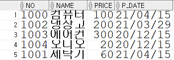

## 1. 아래 칼럼을 가지는 PRODUCT 테이블을 생성하는 DDL 을 작성하시오.
```
제약조건의 이름은 자동으로 부여되도록 별도로 지정하지 마시오. (단, 제약조건의 이름을 지정하더라도 감점하지 않는다.) (10점)

<< 칼럼 정보 >>

1) NO : 제품번호, 숫자, 기본키

2) NAME : 제품명, 문자열 최대 100바이트, 필수

3) PRICE : 제품가격, 숫자

4) P_DATE : 생산일자, 날짜
```

### 정답
```sql
CREATE TABLE PRODUCT(
NO NUMBER PRIMARY KEY,
NAME VARCHAR2(100) NOT NULL,
PRICE NUMBER,
P_DATE DATE
);
```

# 2. PRODUCT테이블에서 NO 칼럼에 활용할 시퀀스를 작성하시오.
- 시퀀스의 이름 : SEQ_PRODUCT_NO
- 증가량은 1이다.
- 시작값은 1000이다
- 캐시를 사용하지 않는다.

### 정답
```SQL
CREATE SEQUENCE SEQ_PRODUCT_NO
INCREMENT BY 1
START WITH 1000
NOCACHE;
```

# 3. PRODUCT 테이블에 아래의 데이터를 삽입하는 코드를 작성하시오.
- NO 칼럼의 데이터는 SEQ_PRODUCT_NO 오라클 시퀀스를 활용하여 입력하시오.
- P_DATE 칼럼의 데이터 중 하나 이상은 반드시 현재 날짜를 호출하는 오라클 함수를 사용하시오.



### 정답
```SQL
INSERT INTO PRODUCT VALUES (SEQ_PRODUCT_NO.NEXTVAL, '컴퓨터', 100, '21/04/15');

INSERT INTO PRODUCT VALUES (SEQ_PRODUCT_NO.NEXTVAL, '세탁기', 60, SYSDATE);

INSERT INTO PRODUCT VALUES (SEQ_PRODUCT_NO.NEXTVAL, '냉장고', 200, '21/03/29');

INSERT INTO PRODUCT VALUES (SEQ_PRODUCT_NO.NEXTVAL, '에어컨', 300, '20/12/15');

INSERT INTO PRODUCT VALUES (SEQ_PRODUCT_NO.NEXTVAL, '오디오', 20, '20/12/15');

```

# 4. PRODUCT 테이블에서 다음 조건을 만족하는 데이터의 정보를 수정하시오.
### 조건
- NO 가 1000 인 데이터의 PRICE 를 20만큼 증가시키시오.

### 정답
```sql
UPDATE PRODUCT SET
PRICE = PRICE + 20
WHERE NO = 1000;
```

# 5. PRODUCT 테이블에서 다음 조건을 만족하는 데이터를 삭제하시오.
### 조건
- NAME 이 '세탁기' 인 데이터를 모두 삭제하시오.

### 정답
```SQL
DELETE FROM PRODUCT
WHERE NAME = '세탁기';
```

# 6. PRODUCT 테이블에서 다음과 같이 데이터를 조회하시오.


### 정답
```sql
SELECT NAME, PRICE
FROM PRODUCT
```

# 7. PRODUCT테이블에서 다음 조건을 만족하는 데이터를 조회하시오.
### 조건
- 모든 레코드와 칼럼을 PRICE가 높은순으로 정렬하여 조회하시오

### 정답
```SQL
SELECT * FROM PRODUCT ORDER BY PRICE DESC;
```

# 8. PRODUCT테이블에서 다음 조건을 만족하는 데이터를 조회하시오.
### 조건
- P_DTAE 별로 그룹화 하여 P_DATE별로 생산된 제품의 평균가격을 조회하시오.
- 평균가격과 P_DATE칼럼을 함께 조회하시오


## 정답
```SQL
SELECT P_DATE, AVG(PRICE)
FROM PRODUCT
GROUP BY P_DATE;
```


# 9. 테이블에 삽입, 수정, 삭제된 내용을 실제로 DB에 반영하는 키워드를 작성하시오.
### 정답
```SQL
COMMIT;
```
# 10. 테이블에 삽입, 수정, 삭제된 내용을 취소하는 키워드를 작성하시오.
### 정답
```SQL
ROLLBACK;
```


