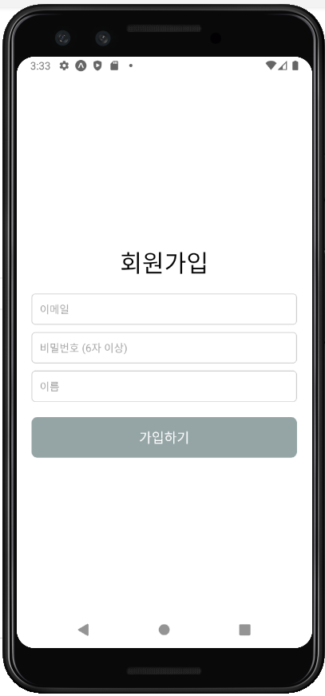

 ## 다음의 문제를 해결하시오
 ## 프로젝트 생성하기
- react-native-exam
- src에 App.js만들기
- src/components/ SignupScreen.js 만들고 아래의 문제 해결하기
 
### 1. 회원가입 화면을 만들려고 한다. 하지만 초기 화면에는 다음과 같은 UX 문제가 있다
- 비밀번호 입력창에 입력한 글자가 그대로 보인다.
- 이메일 형식이 잘못되어도, 비밀번호가 짧아도 "가입하기" 버튼을 누를 수 있다.
- 노치가 있는 핸드폰에서 화면이 잘린다.
- 버튼 터치 범위가 너무 작아서 손이 큰 사람들은 누르기 어렵다.
 
### 구현 조건
- 노치(notch) 있는 기기에서도 화면이 잘리지 않게 한다.
- 이메일, 비밀번호, 이름 세가지를 입력할 수 있는 필드가 존재한다.
- 비밀번호 입력창은 입력값이 보이지 않게 처리한다.
- 이메일이 유효한 형식이 아니거나 비밀번호가 6자 미만이면 "가입하기" 버튼은 비활성화된다.(이메일 정규식 const validateEmail = (email) => /^[^\s@]+@[^\s@]+\.[^\s@]+$/.test(email);)
- 조건을 만족할 때만 "가입하기" 버튼이 활성화되고, 눌렀을 때 **"회원가입 완료"**라는 알림창이 뜬다.
- "가입하기" 버튼은 터치 가능한 영역(hitSlop)을 넓게 만들어서 손이 큰 사람도 쉽게 누를 수 있게 한다.(hitSlop={{ top: 30, bottom: 30, left: 50, right: 50 }})
- 필요한 라이브러리는 각자 설치하기
- 스타일은 styled-components, StyleSheet방식 어떤걸 사용해도 상관없습니다.

  