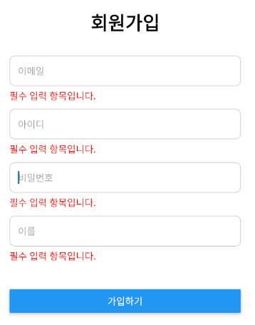
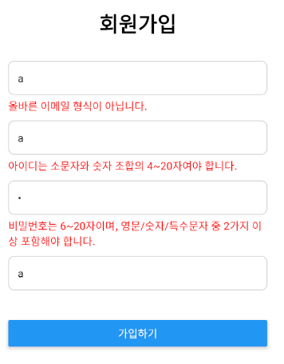

# 📱 React Native 회원가입 화면 구현 과제

## 🧩 프로젝트 정보

- **프로젝트명**: `react-native-test`
- **작성 위치**
  - `src/App.js` → 메인 화면 구성
  - `components/FormInput.js` → 재사용 가능한 입력 필드 컴포넌트

---

## 📁 프로젝트 구조

react-native-test/
├── src/
│ └── App.js # 메인 회원가입 화면
├── components/
│ └── FormInput.js # 공통 입력 컴포넌트


---

## ✅ 구현 요구사항

### 1. 이메일 입력

- **검사 조건**
  - 이메일 형식(`abc@domain.com`)이 아니면 오류
- **오류 메시지**
  - `올바른 이메일 형식이 아닙니다.`

---

### 2. 아이디 입력

- **검사 조건**
  - 영문 소문자 + 숫자 조합만 허용
  - 4~20자 이내
- **오류 메시지**
  - `아이디는 소문자와 숫자 조합의 4~20자여야 합니다.`

---

### 3. 비밀번호 입력

- **검사 조건**
  - 아래 조건 중 2가지 이상 포함:
    - 영문자 (대/소문자)
    - 숫자
    - 특수문자 `!@#$%^&*`
  - 총 길이: 6~20자
- **오류 메시지**
  - `비밀번호는 6~20자이며, 영문/숫자/특수문자 중 2가지 이상 포함해야 합니다.`

---

### 4. 이름 입력

- **검사 조건**
  - 한글 또는 영문만 허용
  - 1~30자 이내
- **오류 메시지**
  - `이름은 한글 또는 영문 1~30자여야 합니다.`

---

### 5. 공통 기능

- **공백 입력 시**
  - 모든 필드는 공백 입력 시 다음 오류 메시지 출력:
    - `필수 입력 항목입니다.`
- **유효성 검사**
  - `onChangeText`, `onBlur` 이벤트로 실시간 검사 적용
- **가입 버튼**
  - 하단에 `가입하기` 버튼 배치
  - 모든 입력값이 유효할 경우 `Alert`로 입력값 출력

---





### 스타일 제공
```js
FormInput의 스타일

const styles = StyleSheet.create({

  container: {

    marginBottom: 10,

  },

  input: {

    borderColor: '#ccc',

    borderWidth: 1,

    borderRadius: 8,

    padding: 12,

  },

  error: {

    color: 'red',

    marginTop: 5,

  },

});

 

App.js 스타일

const styles = StyleSheet.create({

  container: {

    padding: 24,

    paddingTop: 60,

    backgroundColor: '#fff',

    flexGrow: 1,

  },

  header: {

    fontSize: 28,

    fontWeight: 'bold',

    marginBottom: 30,

    textAlign: 'center',

  },

  buttonContainer: {

    marginTop: 30,

    marginBottom: 50,

  },

});
```